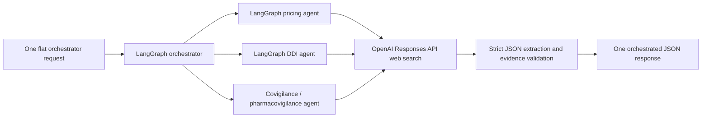

# AscThem Medication Intelligence Agent Service

AscThem is a Python FastAPI service with a LangGraph orchestrator. The current
increment implements the pricing agent with OpenAI Responses API web search and
strict structured output. It also implements official-source DDI and Covigilance
agents. It does not call a GoodRx or SingleCare API.

## Agent workflow



Safety and grounding rules:

- OpenAI must use web search and must return the configured JSON schema.
- Prices may not be estimated, calculated, merged, or inferred.
- A supplied strength is exact. OpenAI must return the strength observed beside
  each price, and the service independently discards missing or different strengths.
  A bare `40` request may match an observed `40 mg`; it cannot match `60 mg`.
- An offer is discarded unless its exact `sourceUrl` appears in the source list
  returned by the OpenAI web-search tool.
- Source provider names are derived from source domains, not trusted from model text.
- Searches are restricted by default to GoodRx, SingleCare, ScriptSave WellRx,
  RxSaver, and Drugs.com.
- Each configured provider domain is searched in its own OpenAI request and the
  validated results are merged. A provider is absent when it returns no directly
  verifiable price for the requested product/location.
- The pricing section contains source-backed offers and exact source links.
- The raw `userId` is included in the requested OpenAI input payload as specified,
  but it is forbidden as a search term. A SHA-256 version is also supplied as the
  OpenAI safety identifier. Review this data-sharing choice with privacy/legal teams.

## Setup

```powershell
py -m venv .venv
.\.venv\Scripts\Activate.ps1
python -m pip install -e ".[dev]"
```

Copy `.env.example` to `.env`, then set at least:

```text
OPENAI_API_KEY=your-openai-api-key
OPENAI_PRICING_MODEL=gpt-5.4-mini
PRICING_SOURCE_DOMAINS=goodrx.com,singlecare.com,wellrx.com,rxsaver.com,drugs.com
OPENAI_DDI_MODEL=gpt-5.4-mini
DDI_SOURCE_DOMAINS=accessdata.fda.gov,fda.gov,dailymed.nlm.nih.gov
OPENAI_COVIGILANCE_MODEL=gpt-5.4-mini
COVIGILANCE_SOURCE_DOMAINS=fda.gov,accessdata.fda.gov,dailymed.nlm.nih.gov
```

Pricing source domains come only from `PRICING_SOURCE_DOMAINS`. Change that variable
to add, remove, or reorder providers, then restart the service. Each configured
domain is searched independently, and returned source URLs must match one of those
configured domains.

Run the API:

```powershell
uvicorn app.main:app --reload --port 3000
```

OpenAPI documentation is available at `http://localhost:3000/docs`.

## Orchestrator API

`POST /api/v1/orchestrator/run`

This is the only public medication-search endpoint. It accepts one flat request and
fans it out to the pricing, DDI, and pharmacovigilance branches. Pricing searches
configured commercial sources, DDI dynamically searches official U.S. labeling
sources, and the
Covigilance branch dynamically searches official post-market safety sources using
the requested drug name. No product names or manufacturer websites are hardcoded.
The public agent identifier remains `pharmacovigilance` for API compatibility.

The request rejects unknown fields. At least one of `ndc`, `gtin`, or `drugName` is
required. `UserId`/`userId` and `postalcode`/`postalCode` are accepted; canonical
serialization uses `userId` and `postalCode`. Use `null` for unavailable optional
values. For compatibility, the literal Swagger placeholder `"string"` is discarded
instead of being sent to web search.

```json
{
  "ndc": "00002821501",
  "gtin": "00300028215018",
  "drugName": "Example Drug",
  "strength": "10 mg",
  "dosageForm": "tablet",
  "manufacturer": "Example Manufacturer",
  "quantity": 30,
  "userId": "user-123",
  "postalCode": "10001"
}
```

The response is JSON and reports all three executed agents:

```json
{
  "status": "complete",
  "executedAgents": ["pricing", "ddi", "pharmacovigilance"],
  "skippedAgents": [],
  "sections": [
    {"agent": "pricing", "data": {"offers": []}},
    {"agent": "ddi", "data": {"boxedWarnings": [], "interactions": []}},
    {
      "agent": "pharmacovigilance",
      "data": {"findings": [], "countsByCategory": {}}
    }
  ]
}
```

The former standalone `POST /api/v1/pricing/search` route has been removed.

### DDI result contract

The DDI section returns boxed warnings separately from at most 10 source-backed
drug-interaction entries. A boxed warning is always emitted first and marked with
`"priority": "highest"` when the selected official label contains one:

```json
{
  "title": "WARNING: RISK OF THYROID C-CELL TUMORS",
  "riskSummary": "Source-backed summary of the boxed risk.",
  "contraindications": ["Contraindication stated by the label"],
  "patientCounseling": "Counseling language summarized from the label.",
  "labelSection": "BOXED WARNING",
  "sourceUrl": "https://dailymed.nlm.nih.gov/dailymed/...",
  "priority": "highest"
}
```

Ordinary interaction entries retain this shape:

```json
{
  "interactingDrugOrClass": "Insulin secretagogues",
  "severity": "not_stated",
  "clinicalEffect": "Effect stated by the official label.",
  "management": "Management stated by the official label, or null.",
  "labelSection": "7 DRUG INTERACTIONS",
  "sourceUrl": "https://dailymed.nlm.nih.gov/dailymed/..."
}
```

Allowed severities are `contraindicated`, `major`, `moderate`, `minor`, and
`not_stated`. The agent may use a graded severity only when the official source uses
that grade. It returns `not_stated` rather than inferring one, preserves drug classes
as classes, never pads the result to reach five entries, and rejects any interaction
whose exact URL was not returned by the web-search tool.

### Covigilance result contract

The Covigilance section returns up to 12 findings across four categories:
`safety_communication`, `recall`, `adverse_event_signal`, and `labeling_change`.
Every finding includes a title, source-backed summary, optional official regulatory
action, optional publication date, and exact official source URL.

The default searches are restricted to FDA, Drugs@FDA, and DailyMed. Configuration
may select only from the provider's built-in registry of recognized authorities,
which also supports EMA, MHRA/UK Government, TGA, Health Canada, and WHO domains.
An arbitrary configured domain causes provider construction to fail. A finding is
discarded unless its URL was returned by the web-search tool, belongs to the official
domain searched in that call, and matches the requested medicine.

Raw spontaneous adverse-event reports and report counts are not converted into
signals. An `adverse_event_signal` is returned only when an official authority has
itself identified or evaluated a potential signal, and the response preserves the
authority's uncertainty. The section warns that a signal alone does not establish
causation and that no returned result does not establish absence of risk.

## Observability and privacy

Run and node metadata is appended to `logs/orchestrator.jsonl` unless
`ORCHESTRATOR_LOG_PATH` is changed. Medication and user payloads are not deliberately
written to these logs.

Keep LangSmith payload hiding enabled if tracing is configured:

```text
LANGSMITH_HIDE_INPUTS=true
LANGSMITH_HIDE_OUTPUTS=true
```

To enable LangSmith run and OpenAI child-span tracing, configure a valid LangSmith
key locally and restart the service:

```text
LANGSMITH_TRACING=true
LANGCHAIN_TRACING_V2=true
LANGSMITH_API_KEY=your-current-langsmith-key
LANGSMITH_PROJECT=ascthem-orchestrator
```

Organization accounts with multiple workspaces may also require
`LANGSMITH_WORKSPACE_ID`. A 403 from both the trace-ingest and projects endpoints
means the configured LangSmith credential/workspace is not authorized; generate a
new key in the intended workspace rather than reusing a committed or old key.

The OpenAI call uses `store=false`. Do not commit `.env` or API keys.

## Tests

```powershell
pytest
```

Tests use fake OpenAI responses and do not make live web or model calls.
